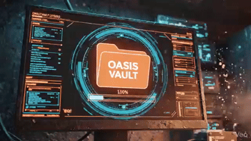

# Clean Obsidian Vault 🌌

1-Click starter kit for digital nomads. A clean, structured, and pragmatic knowledge base for Obsidian, built on the principles of Zen-Mechanics and PARA.

## 🚀 Quick Start

1. **Download** the repository as a ZIP file.
2. **Extract** it anywhere on your drive.
3. **Open Obsidian**, click `Open folder as vault`.
4. Select the extracted `vault/` directory.
5. Done. Welcome to your new Oasis.

## 📂 Structure

- `00_INBOX/` — Catch-all for quick notes and raw ideas.
- `10_PROJECTS/` — Active endeavors with a clear finish line.
- `20_AREAS/` — Ongoing responsibilities (Health, Finance, etc).
- `30_RESOURCES/` — Useful info, references, and external knowledge.
- `40_FINANCE/` — Wealth tracking and energy exchange.
- `99_ARCHIVE/` — Cold storage for completed projects.
- `Templates/` — Pre-built markdown structures (Daily Log, Project Manifest).

---
**Made by Makaric & The AI Tandem**